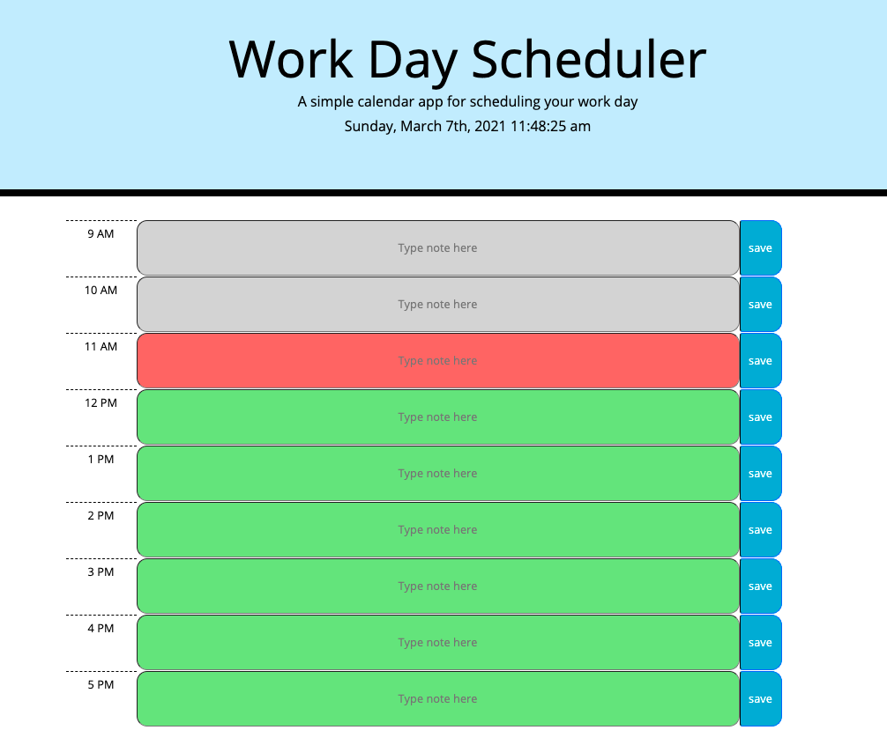

# Work Day Scheduler Starter Code

## Description
This workday scheduler displays the current date and time at the top of the calendar. To use the planner, notes or to-do items can be typed in each box next to corresponding times and saved with the "save" button on the right. Saved items will remain in the planner, even after refreshing the page, using local storage. Time blocks are color-coded with grey indicating time in the past, red indicating the current hour and green indicating future time in the day. This tool is excellent to map out each day to ensure maximum productivity and organization! 

## Launch Work Day Scheduler 
Try out the planner here:  https://telacaul.github.io/work_scheduler/

## Screenshot

## Challenge Requirements
### User Story
* AS AN employee with a busy schedule
* I WANT to add important events to a daily planner
* SO THAT I can manage my time effectively

### Acceptance Criteria
* GIVEN I am using a daily planner to create a schedule
* WHEN I open the planner
* THEN the current day is displayed at the top of the calendar
* WHEN I scroll down
* THEN I am presented with time blocks for standard business hours
* WHEN I view the time blocks for that day
* THEN each time block is color-coded to indicate whether it is in the past, present, or future
* WHEN I click into a time block
* THEN I can enter an event
* WHEN I click the save button for that time block
* THEN the text for that event is saved in local storage
* WHEN I refresh the page
* THEN the saved events persist